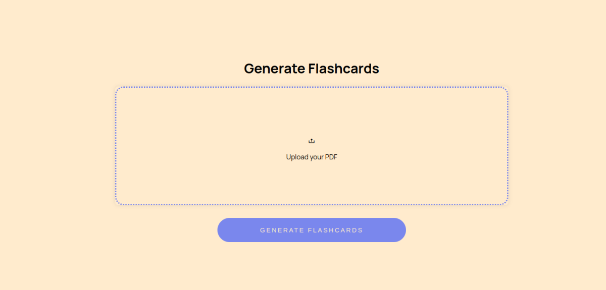

# 📘 Examplify: AI-Driven Exam Preparation Tool

**Examplify** is an AI-powered tool that enables students and educators to effortlessly generate **customized question papers** and **flashcards** from their study materials. Simply upload a **PDF or text file**, and the system will process the content to create **tailored questions and revision materials** based on the provided content.

---

## 🚀 Features

✅ **Upload Study Material**  
   - Accepts educational content in **PDF** and **text format**.  
   - Securely stores uploaded files for processing.  

✅ **AI-Powered Question Generation**  
   - Generates **Multiple-Choice Questions (MCQs)**, **Subjective Questions**, and **True/False** questions.  
   - Allows customization of **difficulty level** and **number of questions**.  

✅ **Flashcard Generation**  
   - Automatically creates **flashcards** with key concepts and summaries from the uploaded content.  
   - Designed to enhance **memory retention and revision**.  

✅ **Retrieval-Augmented Generation (RAG)**  
   - Uses an **embedding model** (Nomic Embed Text) and **vector search database** (Pinecone) for **context-aware** content generation.  

✅ **Fine-Tuned AI Model**  
   - Utilizes a **fine-tuned LLaMA 3.2 model**, optimized for **question-answer generation**.  
   - Employs **instruction-based fine-tuning** for high-quality, structured question creation.  

---

## 🛠️ How It Works

1️⃣ **Upload Your Study Material**  
   - Provide a PDF or text file containing notes, syllabus, or study material.  

2️⃣ **AI Processing & Content Extraction**  
   - The document is processed using **advanced NLP techniques**.  
   - Important topics, key concepts, and relevant context are extracted.  

3️⃣ **Generate Questions & Flashcards**  
   - Choose the **question type** and **difficulty level**.  
   - The AI generates **custom question papers** and **revision flashcards**.  

4️⃣ **Download & Use**  
   - The generated content can be **downloaded and printed** for practice.  

---

## 🏗️ Architecture Overview

🔹 **Data Ingestion**: Users upload study materials, which are **converted into embeddings** for efficient retrieval.  
🔹 **Fine-Tuned Model**: A **LLaMA 3.2-based model** is fine-tuned on structured question-answer pairs.  
🔹 **Retrieval-Augmented Generation (RAG)**: Uses **vector embeddings** to retrieve the most relevant context from the input material.  
🔹 **Content Generation**: AI generates **exam questions and flashcards** based on extracted topics.  


---

## 📊 Uderlying Model

This repository features a fine-tuned LLaMA 3 (3B) model, optimized for generating question-answer pairs across various difficulty levels and question types. The model is based on the quantized version of LLaMA 3 (3B) and has been fine-tuned using Unsloth, leveraging its efficiency for fast and memory-optimized training.


1.​ https://huggingface.co/IamCristiano7/llama3.2-1B-SquadV2-mcq-tf-custom  
2.​ https://huggingface.co/IamCristiano7/llama3.2-1B-SquadV2


<p align="center">
  
</p>


---

## 🖥️ Installation & Setup

### **Installation Steps**  

1. Clone the repository:  
   ```bash
   git clone https://github.com/goeludit/examplify-qa-flashcard-tool
   cd examplify-qa-flashcard-tool
   ```

2. Install dependencies:  
   ```bash
   pip install -r requirements.txt
   ```

3. Run the application:  
   ```bash
   python app.py
   ```

---

## 📂 Screenshots

### Flashcard Generator
 


### Test Generator

<!--  -->
<p align="center">
  
</p>


---

## 📜 License

This project is open-source and available under the **MIT License**.  

---

